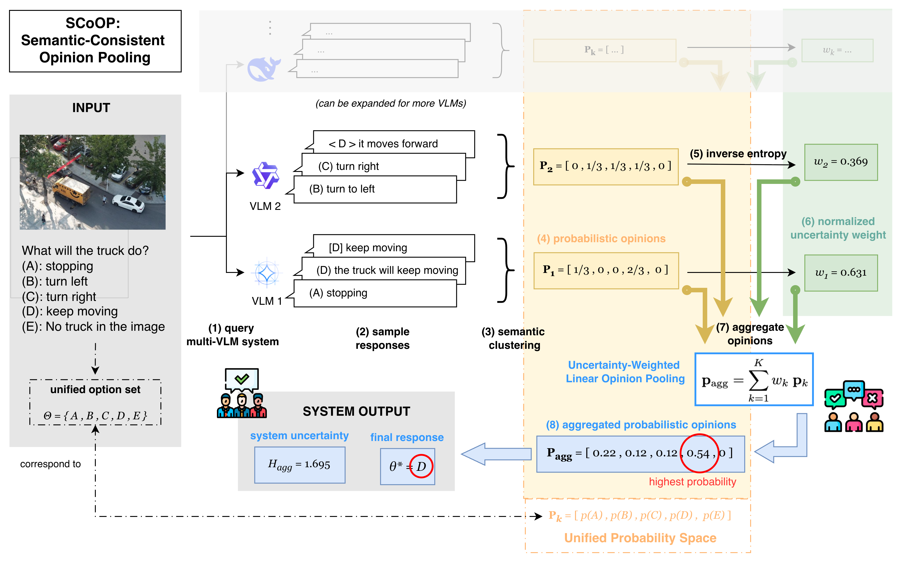

# SCoOP (Semantic Consistent Opinion Pooling)

Official code for: "**SCoOP: Semantic Consistent Opinion Pooling for Uncertainty Quantification in Multiple Vision Language Model Systems**" \[[Website](https://chungenyu6.github.io/chung_en_johnny_yu_website/scoop)\] | \[[arXiv](https://arxiv.org/abs/2603.23853v1)\] 

## 📣 News

- @2026.02.27: SCoOP has been accepted as a poster at the [ICLR 2026 Workshop - Agentic AI in the Wild: From Hallucinations to Reliable Autonomy](https://hallucination-reliable-agentic-ai.github.io/)

## 🎯 Overview



This repository contains the official implementation of the SCoOP pipeline for multiple vision-language models (VLMs) uncertainty aggregation. 


## 🛠️ Install

Clone the repository.

```bash
git clone https://github.com/chungenyu6/SCoOP.git
```

Navigate to the project folder.

```bash
cd SCoOP
```

Create a conda environment for SCoOP with `environment.yml`.

```bash
conda env create -f environment.yml
```

Activate the conda environment.
```bash
conda activate scoop
```

### Note
- VLMs are downloaded from HuggingFace and inferenced by [vLLM](https://vllm.ai/).
- Benchmark datasets are loaded from HuggingFace datasets at runtime.
- For gated models/datasets, login with HuggingFace first.
- The code has tested on NVIDIA A40, B200.

```bash
huggingface-cli login
```


## 🚀 Usage

Primary implementations include the following steps:
1. Run per-model inference on a benchmark and implement an uncertainty quantification (`UQ`) method like Semantic Entropy.
2. Copy per-model logs (`log*.json`) to the same folder and rename them (`log1.json`, `log2.json`, ...).
3. Aggregate multiple model responses and uncertainty with an uncertainty aggregation (`UA`) method like SCoOP to obtain the final system response and uncertainty.

### Stage 1: Per-model Inference and UQ

```bash
python src/eval_uq.py \
  --benchmark ScienceQA \
  --lvlm Qwen2.5-VL-3B-Instruct \
  --uq_method semantic_entropy \
  --inference_temp 0.1 \
  --sampling_temp 1.0 \
  --sampling_time 10 \
  --max_sample 100
```

Arguments:
- `benchmark` is the name of the benchmark, e.g., ScienceQA, MMBench, MMMU.
- `max_sample` is the maximum samples of the benchmark dataset.
- `inference_temp` is the inference temperature of the VLM.
- `sampling_temp` is the sampling temperature of the VLM for Semantic Entropy.
- `sampling_time` is the sampling time of the VLM for Semantic Entropy.
- `uq_method` is the uncertainty quantification method, e.g., Semantic Entropy.
- `lvlm` is the name of the VLM, e.g., Qwen2.5-VL-3B-Instruct. Refer to `eval_uq.py` for more available VLMs.

Outputs are written under path:
`result/uq/{benchmark}/total{max_sample}/itemp{inference_temp}/stemp{sampling_temp}/stime{sampling_time}/{uq_method}/{lvlm}/`
- For example, the above command outputs `result/uq/ScienceQA/total100/itemp0.1/stemp1.0/stime10/semantic_entropy/Qwen2.5-VL-3B-Instruct/`

Each run produces:
- `log.json`
- `result.json`


### Stage 2: Aggregate Multiple Model Responses and Uncertainty

Prepare one directory containing multiple per-model logs named like `log1.json`, `log2.json`, ... (up to 10).
For illustration purpose, we have placed example logs in `result/ua/demo/`.

```bash
python src/eval_ua.py \
  --result_dir "result/ua/demo" \
  --aggregation "scoop" \
  --max_sample 2000
```

Arguments:
- `result_dir` is the directory containing multiple per-model logs.
- `aggregation` is the uncertainty aggregation method, e.g., SCoOP (`scoop`), Majroty Voting (`mv`), and Naive Selection (`ns`).
- `max_sample` is the maximum samples of the benchmark dataset.

Outputs are written under path:
`result/ua/{aggregation}/`
- For example, the above command outputs `result/ua/demo/scoop/`.

Each run produces:
- `fusion_output.json`
- `fusion_result.json`

## 🏛️ Repository Structure

```text
SCoOP/
├── src/
│   ├── benchmark/      # benchmark wrappers
│   ├── lvlm/           # LVLM router
│   ├── uq/             # uncertainty quantification methods
│   ├── ua/             # uncertainty aggregation methods
│   ├── metric/         # metric utils
│   ├── eval_uq.py      # run UQ per model
│   └── eval_ua.py      # aggregate multiple models
├── environment.yml     # conda environment
└── README.md
```

## 💡 Acknowledgements

This work was supported in part by the U.S. Military Academy (USMA) under Cooperative Agreement No. W911NF23-2-0108. The views and conclusions expressed in this paper are those of the authors and do not reflect the official policy or position of the U.S. Military Academy, U.S. Army, U.S. Department of Defense, or U.S. Government.

Also, we are grateful to prior works:
- [Semantic Uncertainty](https://arxiv.org/abs/2302.09664)
- [VL-Uncertainty](https://vl-uncertainty.github.io/)

## 📎 Citation

If you find this work useful, please consider citing our paper:

```bibtex
@article{yu2026scoop,
  title={SCoOP: Semantic Consistent Opinion Pooling for Uncertainty Quantification in Multiple Vision-Language Model Systems},
  author={Yu, Chung-En Johnny and Jalaian, Brian and Bastian, Nathaniel D},
  journal={arXiv preprint arXiv:2603.23853},
  year={2026}
}
```

